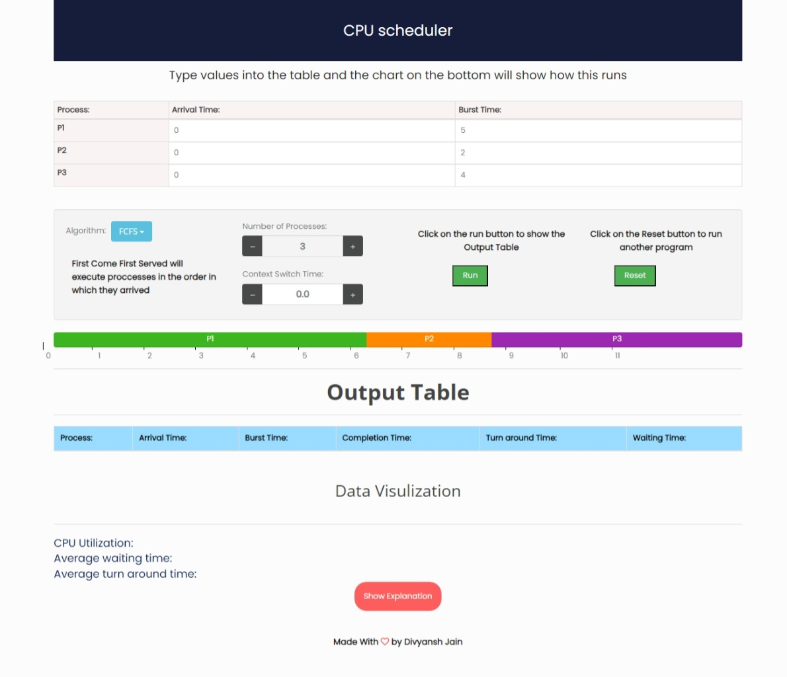

# CPU Scheduling Visualization

This project provides a visual representation of various CPU scheduling algorithms. It includes dynamic charts and tables to demonstrate how different processes are managed by different scheduling algorithms.

## Features

- **Visualization**: Interactive charts for waiting time, turnaround time, and CPU utilization.
- **Algorithms**: Supports FCFS, SJF (non-preemptive), SRJF (preemptive), Round Robin, and Priority scheduling algorithms.
- **User Interaction**: Allows users to input process details and parameters like context switch time and time quantum.
- **Explanation**: Provides detailed explanations of the algorithms used.

## Technologies Used

- HTML, CSS, JavaScript
- Bootstrap for responsive design
- Chart.js for data visualization

## Usage

1. Clone the repository.
2. Open `index.html` in your web browser.
3. Input process details and select an algorithm.
4. Click **Run** to visualize the scheduling process.

## Screenshots

